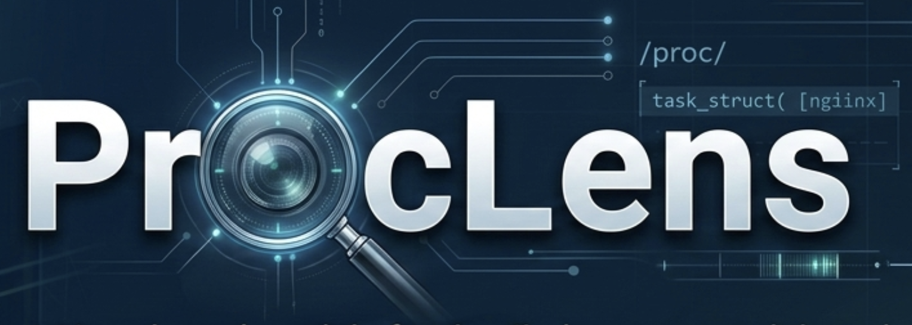
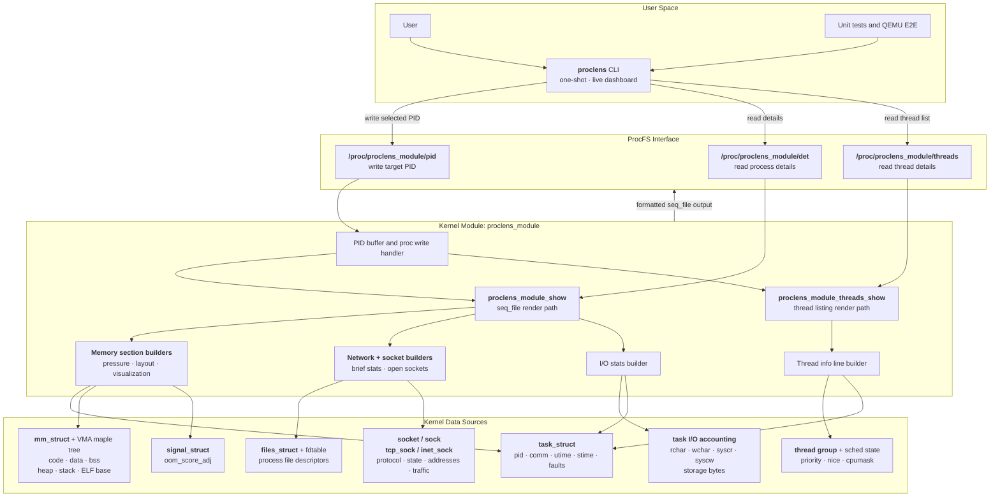

# ProcLens



[](https://github.com/navidpadid/ProcLens/actions/workflows/ci.yml)
[](https://github.com/navidpadid/ProcLens/commits/main)
[](LICENSE)

> A Linux kernel module that surfaces process and thread details through `/proc`, including memory layout, CPU usage, network/socket activity, per-process I/O accounting, and live section-based inspection.

## Live Demo


## Table of Contents

- [Features](#features)
- [Quick Start](#quick-start)
- [Release Binaries](#release-binaries)
- [Makefile Targets](#makefile-targets)
- [Testing](#testing)
- [Architecture Diagram](#architecture-diagram)
- [Project Structure](#project-structure)
- [Output Notes](#output-notes)
- [Code Quality](#code-quality)
- [Documentation](#documentation)
- [Contributing](#contributing)
- [License](#license)

## Features

- **Process Memory Layout**: Code, Data, BSS, Heap, and Stack addresses
- **Memory Pressure Monitoring**: RSS, VSZ, swap usage, page faults (major/minor), and OOM score adjustment
- **Visual Memory Map**: Proportional bar chart visualization of memory regions
- **Open Sockets**: List all open sockets with family, type, state, protocol, addresses, and per-socket traffic stats
- **Network Stats (Brief)**: Per-process TCP counters, socket counts (TCP/UDP/UNIX), drops, net devices, and top talkers
- **I/O Stats**: Per-process I/O accounting (`rchar`, `wchar`, `syscr`, `syscw`, storage bytes) with averages and intensity
- **Thread Information**: List all threads with TID, state, CPU usage, priority, and CPU affinity
- **CPU Usage Tracking**: Real-time CPU percentage calculation per process and thread
- **ELF Section Analysis**: Binary base address and section boundaries
- **Proc Interface**: Easy access through `/proc/proclens_module/`
- **Live Dashboard Mode**: No-arg mode refreshes every 1s with switchable Memory, Network, Threads, and I/O sections
- **Comprehensive Testing**: Unit tests and QEMU-based E2E testing
- **Code Quality**: Pre-configured static analysis (sparse, cppcheck, checkpatch)

## Quick Start

### Prerequisites

- **Docker** + **VS Code** with Remote - Containers extension
- Dev container includes everything: Ubuntu 24.04, kernel 6.8+ headers, build tools, static analysis

### Build and Run

1. Open project in VS Code → "Reopen in Container"
2. Build:
   ```bash
   make all
   ```
3. Install module:
   ```bash
   sudo make install
   ```
4. Run user program:
   ```bash
   sudo ./build/proclens
   ```

### Live Mode (No Parameters)

Running without arguments starts a live dashboard:

- Auto-refreshes every 1 second
- Defaults to section `1` (memory-related output)
- Shows quick controls at the top: `1` memory, `2` network, `3` threads, `4` I/O
- Shows command hints in-app: `1/2/3/4` switch sections, `0` changes PID
- Prints timestamps at top and bottom in `YY/MM/DD HH:MM:SS`
- Keeps a snapshot history (up to 120 entries) for in-app navigation
- Press Up/`k` for older snapshots, Down/`j` for newer snapshots, `f` to resume live follow
- Press `0` to switch to another process ID (no Enter needed)

> **Caveat for WSL/macOS + Docker dev containers:**
> If your container kernel does not expose matching host kernel sources/headers,
> direct module builds can fail with errors like:
>
> ```text
> make -C /lib/modules/$(uname -r)/build M=/workspaces/ProcLens/src modules
> make[1]: *** /lib/modules/.../build: No such file or directory.  Stop.
> ```
>
> In that case, use the isolated QEMU workflow instead:
>
> ```bash
> sudo ./e2e/qemu-setup.sh
> sudo ./e2e/qemu-run.sh
> sudo ./e2e/qemu-test.sh
> ```

### Uninstall the Module

```bash
sudo make uninstall
```


## Release Binaries

Download prebuilt binaries from GitHub Releases:

- Latest release: https://github.com/navidpadid/ProcLens/releases/latest
- All releases: https://github.com/navidpadid/ProcLens/releases

> **Important:** Prebuilt kernel module releases are currently provided **only** for
> **Linux kernel 6.8.0** (the standard Ubuntu 24.04 LTS kernel).
>
> If your system runs any other kernel version, build from source instead.


After downloading, the preferred installation/update path is to use the bundled installer scripts:

```bash
sudo ./install.sh
sudo proclens --version
sudo proclens
sudo ./uninstall.sh
```

Manual install/run is still possible if needed:

```bash
sudo insmod ./proclens_module.ko
sudo ./proclens
```

If the module was previously installed via `make install` or `install.sh`, you can also load it with:

```bash
sudo modprobe proclens_module
```

To unload the module:

```bash
sudo rmmod proclens_module
```

More detailed information is bundled with the release packages.


## Makefile Targets

```bash
Build Targets:
  make all               - Build both kernel module and user program (default)
  make module            - Build kernel module only
  make user              - Build user program only
  make build-multithread - Build multi-threaded test program

Run Targets:
  make install           - Install kernel module (requires root)
  make uninstall         - Remove kernel module (requires root)
  make test              - Install module and run user program

Test Targets:
  make unit              - Build and run function-level unit tests
  make run-multithread   - Install module and test multi-thread program

Code Quality Targets:
  make check             - Run all static analysis checks
  make checkpatch        - Check kernel coding style with checkpatch.pl
  make sparse            - Run sparse static analyzer
  make cppcheck          - Run cppcheck static analyzer
  make format            - Format code with clang-format
  make format-check      - Check if code is properly formatted (CI)

Cleanup Targets:
  make clean             - Remove all build artifacts
```

## Testing

### Unit Tests (Recommended First)
```bash
make unit
```
Runs pure function tests without kernel dependencies.

### Multi-threaded Module Test
```bash
make run-multithread
```
Builds the multi-threaded test program, installs the module, and validates output via the user program.

### QEMU Testing (Safe Kernel Testing)
```bash
sudo ./e2e/qemu-setup.sh    # One-time setup
sudo ./e2e/qemu-run.sh      # Start VM
sudo ./e2e/qemu-test.sh     # Run automated tests
```

## Architecture Diagram



## Project Structure

```
ProcLens/
├── .devcontainer/      # Dev container config (Docker + VS Code setup)
├── .github/            # CI/CD workflows (GitHub Actions)
├── docs/               # Detailed documentation
├── e2e/                # End-to-end testing scripts (QEMU setup, automation)
├── src/                # Source code (kernel module, user program, tests, helpers)
├── build/              # Build artifacts (generated by make)
└── Makefile            # Build system with quality checks
```

## Output Notes

- **Memory Visualization**: Each region's bar length is proportional to its actual size
- Sizes are automatically displayed in appropriate units (B, KB, or MB)
- Low/High addresses show the memory address range of the process
- BSS_START and BSS_END may be equal (zero-length BSS) in modern ELF binaries. This is normal.
- **Open Sockets**: Shows file descriptor, socket family, type, state, protocol, addresses, and traffic stats for TCP/UDP sockets
- Socket families: AF_INET (IPv4), AF_INET6 (IPv6), AF_UNIX (Unix domain), AF_NETLINK (Netlink)
- UDP traffic values are queue-based (current queued packets/bytes), while TCP traffic values are lifetime socket counters.
- **Top Talkers**: The `[network]` section includes up to three sockets ranked by total bytes (`RX + TX`) at read time.
- **I/O Stats**: The `[io]` section includes syscall bytes/counters, storage bytes, derived average bytes per syscall, and `io_intensity` (`read_bytes + write_bytes`).
- If the running kernel disables task I/O accounting (`CONFIG_TASK_XACCT`), the I/O section prints a clear `status: unavailable` line instead of counters.
- Thread STATE: R=Running, S=Sleeping, D=Uninterruptible, T=Stopped, t=Traced, Z=Zombie, X=Dead
- PRIORITY: Shown as nice value (-20 to 19, where lower is higher priority)
- CPU_AFFINITY: Shows which CPUs the thread can run on

## Code Quality

### Static Analysis Tools

#### checkpatch.pl
Official Linux kernel coding style checker. Enforces kernel coding standards including:
- Indentation and spacing rules
- Line length limits
- Function declaration style
- Comment formatting
- Macro usage patterns

#### sparse
Semantic parser specifically designed for kernel code. Detects:
- Type confusion errors
- Endianness issues
- Lock context imbalances
- Address space mismatches
- Null pointer dereferences

#### cppcheck
General-purpose C/C++ static analyzer. Finds:
- Memory leaks
- Buffer overflows
- Uninitialized variables
- Dead code
- Logic errors

#### clang-format
Code formatter that ensures consistent style:
- 8-space tabs (kernel standard)
- 100-column relaxed kernel limit used by this project
- Linux brace style
- Proper spacing and alignment

## Documentation

- [TESTING.md](docs/TESTING.md) - Unit tests, QEMU testing, troubleshooting
- [TECHNICAL.md](docs/TECHNICAL.md) - Kernel module details, memory layout, limitations
- [CODE_QUALITY.md](docs/CODE_QUALITY.md) - Static analysis, code formatting, best practices
- [SCRIPTS.md](docs/SCRIPTS.md) - Detailed script documentation
- [RELEASE.md](docs/RELEASE.md) - Version release process and guidelines
- [AGENTIC_WORKFLOW.md](docs/AGENTIC_WORKFLOW.md) - High-level guide for the docs agent workflow

## Contributing

Contributions welcome! The project includes:
- Pre-configured dev container
- Automated testing (unit tests + QEMU E2E)
- Static analysis and formatting tools
- GitHub Actions CI/CD

## License

MIT License. See [LICENSE](LICENSE) for full terms.